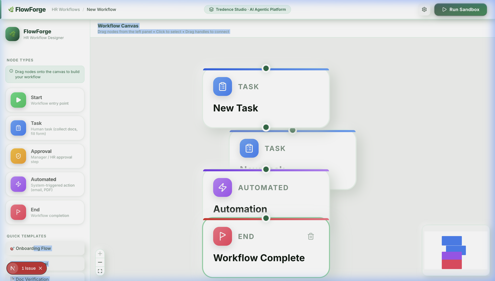
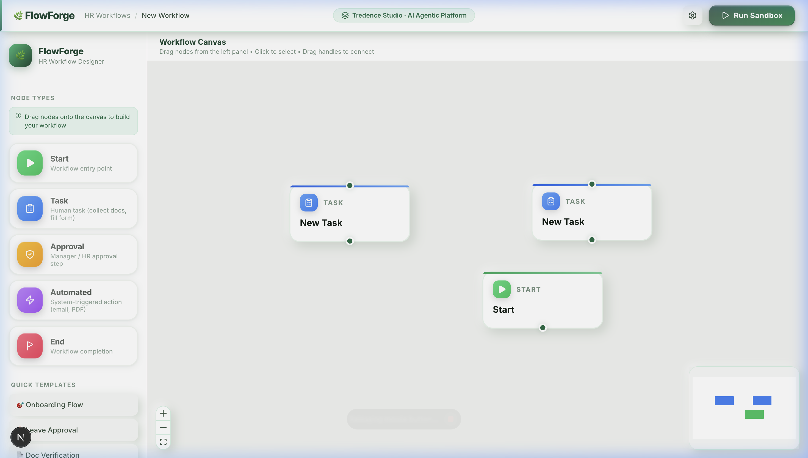
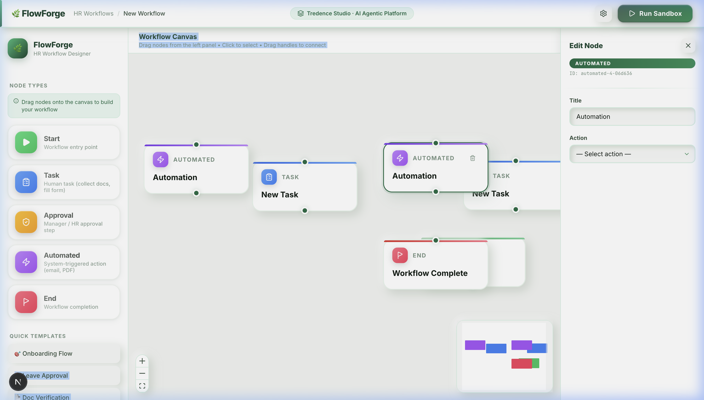
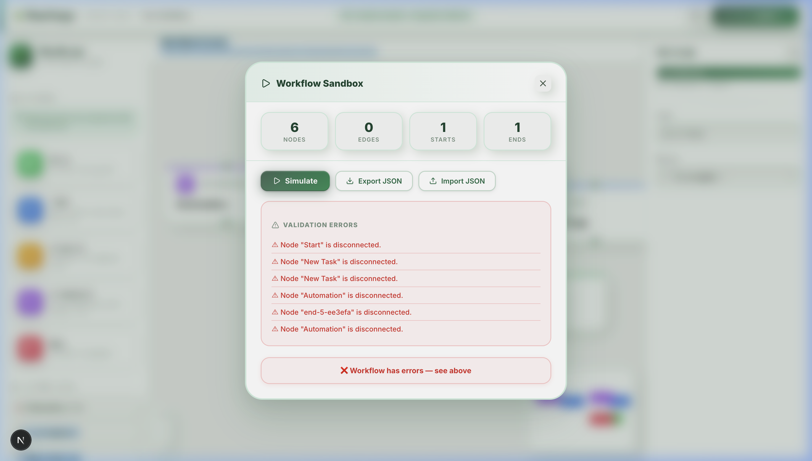

# ⚡ FlowForge — HR Workflow Designer

> **Tredence Studio · AI Agentic Platform — Full Stack Internship Submission**

A production-grade, neumorphic HR Workflow Designer built with **Next.js 16**, **React Flow (xyflow)**, and **TypeScript**. Design, configure, and simulate complex HR workflows visually — from employee onboarding to leave approval and document verification.

---

## 📸 App Screenshots

  
*Clean white dashboard with iOS-style palette cards and premium styling.*

  
*Interactive canvas where nodes have color-coded accent stripes.*

  
*Slide-in editing form with neumorphic inputs and dark green badges.*

  
*Built-in sandbox simulation engine with live graph validation.*

---

## ✨ Features

### 🎨 UI/UX
- **Neumorphic dark design system** — soft shadows, inset inputs, depth-first elevation
- Smooth micro-animations and hover transitions throughout
- Fully responsive layout with sidebar, canvas, and sliding form panel

### 🗺 Workflow Canvas (React Flow)
- **Drag-and-drop** nodes from the sidebar palette onto the canvas
- Five custom node types: Start, Task, Approval, Automated, End
- **Connect nodes** by dragging from handles (top/bottom)
- **Select** a node to open its configuration panel
- **Delete** nodes or edges (click "×" on node, or click an edge to delete)
- MiniMap for overview navigation
- Zoom controls + fit-view

### 📝 Node Configuration Forms
Each node type has a dedicated "Edit Node" panel with type-safe controlled components:

| Node | Fields |
|------|--------|
| **Start** | Title, Metadata key-value pairs |
| **Task** | Title*, Description, Assignee, Due Date, Custom key-value fields |
| **Approval** | Title, Approver Role (Manager/HRBP/Director), Auto-approve threshold (hrs) |
| **Automated** | Title, Action (from mock API), Dynamic action params |
| **End** | End Message, Summary Report toggle |

### 🔌 Mock API Layer
- `GET /automations` — returns available automation actions (Send Email, Generate Doc, Slack Notify, Create Jira Ticket, Update HRIS)
- `POST /simulate` — accepts workflow JSON, runs topological-sort simulation, returns step-by-step execution log
- Configurable latency to simulate real async calls

### 🧪 Workflow Sandbox
- Live stats (node count, edge count, start/end nodes)
- One-click **Simulate** — runs validation + topological execution
- **Timeline execution log** with timestamped steps, colour-coded by node type
- Validation error detection: missing start/end, disconnected nodes, cycles
- **Export JSON** — downloads the workflow as `workflow.json`
- **Import JSON** — paste JSON to load a saved workflow

---

## 🏗 Architecture

```
hr-workflow-designer/
├── app/
│   ├── globals.css          # Full neumorphic design system (tokens, components)
│   ├── layout.tsx           # Root layout + SEO metadata
│   └── page.tsx             # Shell — composes sidebar, canvas, panels
├── components/
│   ├── nodes/
│   │   ├── StartNode.tsx    # Green — entry point
│   │   ├── TaskNode.tsx     # Blue — human tasks
│   │   ├── ApprovalNode.tsx # Amber — approval steps
│   │   ├── AutomatedNode.tsx# Purple — system actions
│   │   └── EndNode.tsx      # Red — completion
│   ├── WorkflowCanvas.tsx   # React Flow wrapper, drag-drop, edge handling
│   ├── Sidebar.tsx          # Node palette + quick templates
│   ├── NodeFormPanel.tsx    # Per-type edit forms (all form logic here)
│   └── SandboxPanel.tsx     # Simulation modal + import/export
├── context/
│   └── WorkflowContext.tsx  # Global state — nodes, edges, selection, CRUD
├── lib/
│   └── mockApi.ts           # GET /automations, POST /simulate (local mocks)
└── types/
    └── workflow.ts          # All TypeScript interfaces (discriminated unions)
```

### Key Design Decisions

**Discriminated Union Node Data**  
Each node is typed with a `kind` discriminant (`StartNodeData | TaskNodeData | ...`), making form rendering exhaustive and safely extensible — adding a new node type means adding one interface and one form component.

**Separation of Concerns**  
- `WorkflowContext` owns all state mutations (add/delete/update nodes, edges)
- `WorkflowCanvas` owns React Flow rendering and drag-drop events
- `NodeFormPanel` owns per-type form rendering and validation
- `mockApi.ts` owns all API concerns — swap for real fetch() calls without touching components

**Custom Hooks Pattern**  
`useWorkflow()` exposes a clean, typed API for all canvas operations; components never call `setNodes` directly.

**Extensible Form System**  
`NodeFormPanel` switches on `data.kind` to render a dedicated sub-form. Each sub-form is an isolated function component — adding a new node type requires zero changes to existing code.

---

## 🚀 Getting Started

```bash
# Install dependencies
npm install

# Run development server
npm run dev

# Open in browser
open http://localhost:3000
```

### Building a workflow
1. **Drag** a node type from the left sidebar onto the canvas
2. **Click** a node to open its configuration form on the right
3. Edit fields → changes apply in real-time to the canvas node
4. **Connect nodes** by hovering over a node's handle (circle) and dragging to another node
5. Click **Run Sandbox** to validate and simulate the workflow

---

## 🎯 What I Completed

- [x] Full neumorphic dark design system from scratch (CSS custom properties, no Tailwind runtime)  
- [x] 5 custom typed React Flow nodes  
- [x] Dynamic per-node edit forms with controlled inputs and KV-pair editors  
- [x] Mock API layer (automations + simulation)  
- [x] Workflow sandbox with topological execution, validation, and timeline UI  
- [x] Export / Import JSON  
- [x] TypeScript strict typing throughout with discriminated unions  
- [x] Clean folder structure with separated concerns  
- [x] SEO metadata  

## 🔮 What I'd Add With More Time

- **Undo/Redo** — using `useHistoryState` or `immer` patches  
- **Auto-layout** — dagre or ELK algorithm for one-click graph layout  
- **Node templates** — pre-built onboarding, leave-approval, doc-verification flows  
- **Edge labels** — conditional branching (approve/reject paths)  
- **Workflow validation hints** — inline error badges on invalid nodes  
- **Version history** — store snapshots in localStorage  
- **Unit tests** — Jest + RTL for context and form components  
- **E2E tests** — Playwright for drag-drop and simulation flows  
- **Backend persistence** — PostgreSQL via Next.js API routes  
- **Real auth** — NextAuth.js with Azure AD OIDC  

---

## 🛠 Tech Stack

| Layer | Technology |
|-------|-----------|
| Framework | Next.js 16 (App Router, Turbopack) |
| Language | TypeScript (strict) |
| Canvas | @xyflow/react (React Flow v12) |
| Styling | Vanilla CSS (neumorphic dark design system) |
| State | React Context + useReducer pattern |
| Icons | lucide-react |
| IDs | uuid |
| Fonts | Inter + JetBrains Mono (Google Fonts) |

---

*Built for Tredence Studio AI Engineering Internship — 2025 Cohort*
# hr-workflow
